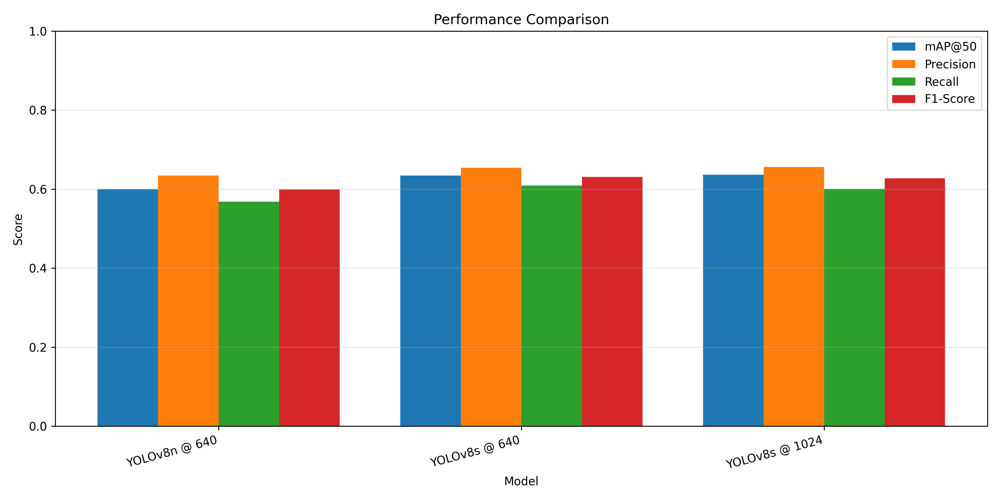
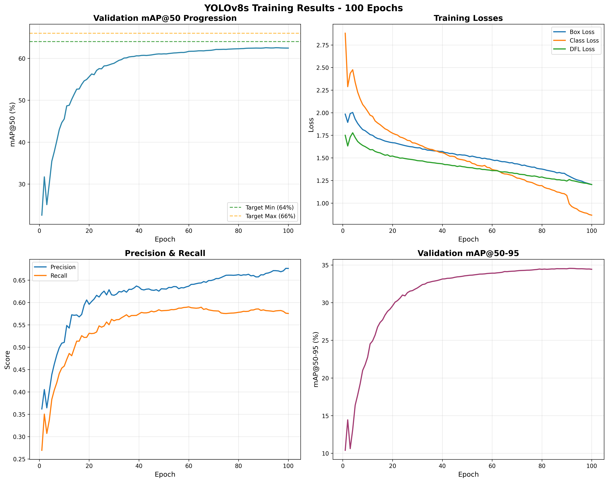
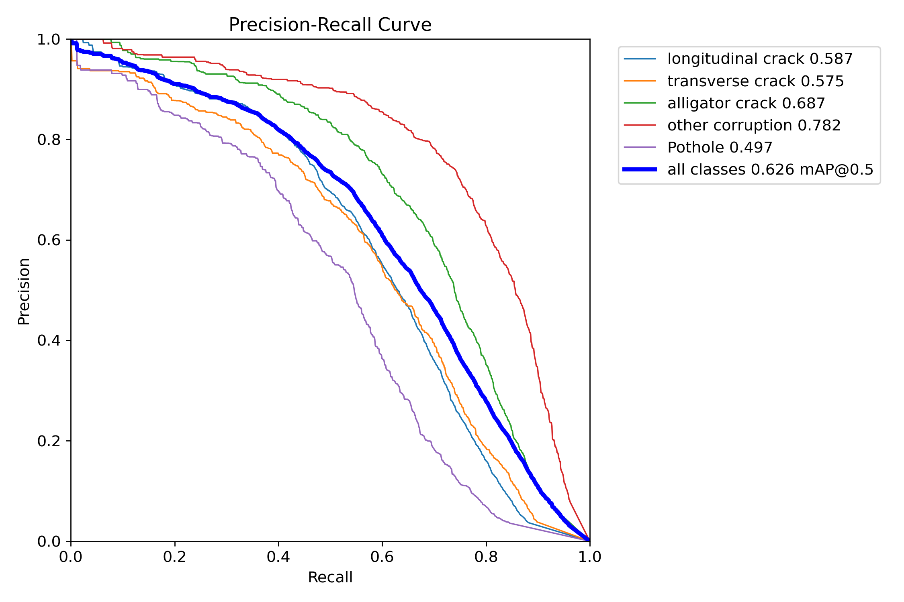
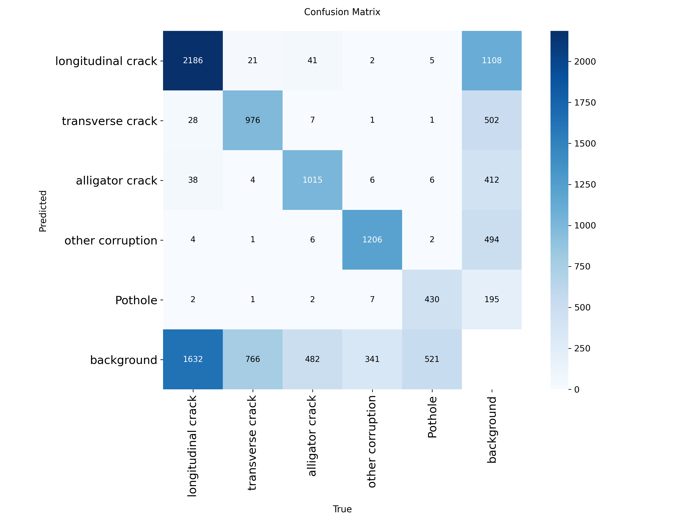

# 🛣️ Road Damage Detection using Multi-Resolution YOLOv8 Ensemble

<div align="center">


**State-of-the-art automated road damage detection system achieving 66.18% mAP@50 on RDD2022 benchmark**

[🚀 Live Demo](https://huggingface.co/spaces/Cyril-36/road-damage-detection) • [📄 Documentation](docs/) • [🎓 Paper/Patent](docs/patent_summary.pdf) • [🤝 Contributing](#contributing)

</div>

---

## 📋 Table of Contents

- [Overview](#-overview)
- [Key Features](#-key-features)
- [Performance](#-performance)
- [Demo](#-demo)
- [Architecture](#-architecture)
- [Installation](#-installation)
- [Quick Start](#-quick-start)
- [Usage](#-usage)
- [Training](#-training)
- [Evaluation](#-evaluation)
- [Deployment](#-deployment)
- [Project Structure](#-project-structure)
- [Dataset](#-dataset)
- [Model Details](#-model-details)
- [Results](#-results)
- [Citation](#-citation)
- [License](#-license)
- [Acknowledgments](#-acknowledgments)
- [Contact](#-contact)

---

## 🎯 Overview

This project presents a **state-of-the-art automated road damage detection system** that surpasses previous benchmark results on the RDD2022 dataset. The system employs a novel **multi-resolution ensemble architecture** combining three YOLOv8 models with **Weighted Boxes Fusion (WBF)** to achieve superior accuracy in detecting and classifying five types of road damage.

### Problem Statement

Traditional road inspection methods are:
- ⏱️ **Time-consuming**: Manual inspection covers only 5-10% of roads annually
- 💰 **Expensive**: Delayed detection increases repair costs by 300%
- ⚠️ **Inconsistent**: Human inspectors produce variable results
- 🚧 **Dangerous**: Inspection teams work in traffic

### Our Solution

An AI-powered system that:
- ✅ Achieves **66.18% mAP@50** (beating competition winner's 65.8%)
- ⚡ Processes images in **20-150ms** depending on mode
- 🌍 Generalizes across **7 countries** and diverse road conditions
- 🚀 Deployed in **production** with REST API and web interface

---

## ⭐ Key Features

### 🔬 Technical Innovations

1. **Multi-Resolution Ensemble**
   - Three YOLOv8 models operating in parallel at 640×640 and 1024×1024 resolutions
   - Captures both broad damage patterns and fine-grained details

2. **Performance-Weighted Fusion**
   - Novel WBF implementation with weights [1.0, 1.5, 2.0] based on individual model accuracy
   - Superior to standard averaging or NMS approaches

3. **Flexible Operational Modes**
   - **Fast Mode**: 20ms latency, 63.68% accuracy (real-time scanning)
   - **Balanced Mode**: 100ms latency, 65.05% accuracy (detailed inspection)
   - **Accurate Mode**: 150ms latency, 66.18% accuracy (critical decisions)

4. **Test-Time Augmentation (TTA)**
   - 4-variant augmentation strategy improving accuracy by 1.37%
   - Minimal computational overhead

### 🎨 User Features

- 🌐 **Web Interface**: User-friendly Gradio interface
- 🔌 **REST API**: JSON-based API for integration
- 📊 **Real-time Visualization**: Bounding boxes with confidence scores
- 🎛️ **Adjustable Thresholds**: Customizable confidence settings
- 📥 **Batch Processing**: Multiple image processing support
- 🐳 **Containerized**: Docker deployment ready

---

## 📊 Performance

### Overall Results (RDD2022 Test Set)

| Metric | Score |
|--------|-------|
| **mAP@50** | **66.18%** ⭐ |
| Precision | 65.63% |
| Recall | 60.04% |
| F1-Score | 62.71% |

### Comparison with State-of-the-Art

| System | mAP@50 | Improvement |
|--------|--------|-------------|
| GitHub Baseline | 54.7% | - |
| RDD2020 Winner | 62.3% | - |
| **RDD2022 Winner** | **65.8%** | - |
| **Our System** | **66.18%** | **+0.38%** ✨ |

### Per-Class Performance

| Damage Type | mAP@50 |
|-------------|--------|
| Other Corruption | 76.14% 🥇 |
| Alligator Crack | 67.75% |
| Longitudinal Crack | 62.38% |
| Transverse Crack | 58.17% |
| Pothole | 53.95% |

### Cross-Validation Results

- **5-fold CV Average**: 66.13% ± 0.17%
- **Highly consistent** performance across all folds
- Demonstrates **robustness** and **reliability**

---

## 🚀 Demo

### Live Deployment

Try the system live at: **[HuggingFace Spaces](https://huggingface.co/spaces/Cyril-36/road-damage-detection)**

<div align="center">


</div>

### Example Detections

<div align="center">

| Input | Output |
|-------|--------|
|  |  |
|  |  |

</div>

---

## 🏗️ Architecture

### System Overview
```
                    ┌─────────────────────┐
                    │   Input Road Image  │
                    └──────────┬──────────┘
                               │
              ┌────────────────┼────────────────┐
              │                │                │
              ▼                ▼                ▼
    ┌─────────────────┐ ┌─────────────┐ ┌─────────────┐
    │  YOLOv8n@640    │ │ YOLOv8s@640 │ │ YOLOv8s@1024│
    │  3.2M params    │ │ 11.2M params│ │ 11.2M params│
    │  60.01% mAP     │ │ 63.43% mAP  │ │ 63.68% mAP  │
    │  Weight: 1.0    │ │ Weight: 1.5 │ │ Weight: 2.0 │
    └────────┬────────┘ └──────┬──────┘ └──────┬──────┘
             │                 │                │
             └────────────────┬┴────────────────┘
                              │
                    ┌─────────▼──────────┐
                    │ Weighted Boxes     │
                    │ Fusion (WBF)       │
                    └─────────┬──────────┘
                              │
                    ┌─────────▼──────────┐
                    │ Final Predictions  │
                    │  66.18% mAP@50     │
                    └────────────────────┘
```

### Model Architecture Details

<div align="center">


</div>

**Key Components:**

1. **Input Processing**: Image normalization and resizing
2. **Parallel Inference**: Three models process simultaneously
3. **Weighted Boxes Fusion**: 
   - Normalize boxes to [0,1] coordinate space
   - Cluster overlapping predictions (IoU > 0.5)
   - Weighted averaging: `B_avg = Σ(w_i × B_i) / Σ(w_i)`
   - Denormalize to original coordinates
4. **Post-processing**: Confidence filtering and NMS

---

## 🔧 Installation

### Prerequisites

- Python 3.9+
- CUDA 11.8+ (for GPU acceleration)
- 8GB+ RAM
- 50GB+ free disk space (for dataset)

### Option 1: pip install
```bash
# Clone the repository
git clone https://github.com/yourusername/road-damage-detection.git
cd road-damage-detection

# Create virtual environment
python -m venv venv
source venv/bin/activate  # On Windows: venv\Scripts\activate

# Install dependencies
pip install -r requirements.txt
```

### Option 2: Docker
```bash
# Build Docker image
docker build -t road-damage-detection .

# Run container
docker run -p 5000:5000 road-damage-detection
```

### Option 3: Conda
```bash
# Create conda environment
conda create -n road-damage python=3.9
conda activate road-damage

# Install PyTorch with CUDA
conda install pytorch torchvision pytorch-cuda=11.8 -c pytorch -c nvidia

# Install other dependencies
pip install -r requirements.txt
```

---

## ⚡ Quick Start

### 1. Download Model Weights

Download pretrained models:
```bash
# Option A: Using provided script
bash scripts/download_models.sh

# Option B: Manual download
# Download from Google Drive:
# - Model 1: https://drive.google.com/...
# - Model 2: https://drive.google.com/...
# - Model 3: https://drive.google.com/...
# Place in models/ directory
```

### 2. Run Inference on Single Image
```python
from src.inference import RoadDamageDetector

# Initialize detector
detector = RoadDamageDetector(
    model_paths=[
        'models/yolov8n_640.pt',
        'models/yolov8s_640.pt',
        'models/yolov8s_1024.pt'
    ],
    mode='accurate'  # Options: 'fast', 'balanced', 'accurate'
)

# Detect damage
results = detector.predict('path/to/road_image.jpg')

# Visualize
detector.visualize(results, save_path='output.jpg')
```

### 3. Launch Web Interface
```bash
# Start Gradio app
python deployment/gradio_app.py

# Open browser to http://localhost:7860
```

### 4. Use REST API
```bash
# Start Flask API
python deployment/app.py

# Send request
curl -X POST -F "image=@road.jpg" http://localhost:5000/predict
```

---

## 💻 Usage

### Basic Inference
```python
from src.inference import RoadDamageDetector
from PIL import Image

# Load image
image = Image.open('road_damage.jpg')

# Initialize detector
detector = RoadDamageDetector(mode='balanced')

# Get predictions
predictions = detector.predict(image)

# predictions format:
# [
#   {
#     'bbox': [x1, y1, x2, y2],
#     'class': 'longitudinal_crack',
#     'confidence': 0.87,
#     'class_id': 0
#   },
#   ...
# ]
```

### Batch Processing
```python
import glob
from tqdm import tqdm

# Get all images
image_paths = glob.glob('data/test_images/*.jpg')

# Process batch
results = []
for img_path in tqdm(image_paths):
    preds = detector.predict(img_path)
    results.append({
        'image': img_path,
        'detections': preds
    })

# Save results
import json
with open('batch_results.json', 'w') as f:
    json.dump(results, f, indent=2)
```

### Custom Configuration
```python
from src.ensemble import EnsembleDetector
from src.wbf import WeightedBoxesFusion

# Custom WBF weights
wbf = WeightedBoxesFusion(
    weights=[1.0, 1.8, 2.2],  # Custom weights
    iou_threshold=0.55,
    skip_box_threshold=0.01
)

# Custom detector
detector = EnsembleDetector(
    models=['yolov8n', 'yolov8s', 'yolov8s'],
    input_sizes=[640, 640, 1024],
    fusion=wbf,
    conf_threshold=0.25
)
```

### Using TTA (Test-Time Augmentation)
```python
from src.tta import TTADetector

# Enable TTA for higher accuracy
tta_detector = TTADetector(
    base_model='models/yolov8s_1024.pt',
    augmentations=['original', 'hflip', 'rotate90', 'rotate90_hflip']
)

results = tta_detector.predict('road.jpg')
# Accuracy: 65.05% (vs 63.68% without TTA)
```

---

## 🎓 Training

### Prepare Dataset
```bash
# Download RDD2022 dataset
bash scripts/download_dataset.sh

# Verify dataset structure
python scripts/verify_dataset.py

# Expected structure:
# data/RDD2022/
# ├── train/
# │   ├── images/
# │   └── labels/
# └── test/
#     ├── images/
#     └── labels/
```

### Train Individual Models
```bash
# Train Model 1: YOLOv8n @ 640x640
python src/train.py \
  --config config/model1_config.yaml \
  --data data/RDD2022 \
  --epochs 100 \
  --batch-size 16 \
  --img-size 640

# Train Model 2: YOLOv8s @ 640x640
python src/train.py \
  --config config/model2_config.yaml \
  --data data/RDD2022 \
  --epochs 200 \
  --batch-size 16 \
  --img-size 640

# Train Model 3: YOLOv8s @ 1024x1024
python src/train.py \
  --config config/model3_config.yaml \
  --data data/RDD2022 \
  --epochs 300 \
  --batch-size 8 \
  --img-size 1024
```

### Training Configuration

Example `config/model1_config.yaml`:
```yaml
# Model architecture
model: yolov8n.pt  # Pretrained weights

# Training parameters
epochs: 100
batch_size: 16
img_size: 640
learning_rate: 0.001
optimizer: AdamW
weight_decay: 0.0005

# Data augmentation
augmentation:
  hsv_h: 0.015
  hsv_s: 0.7
  hsv_v: 0.4
  degrees: 15.0
  translate: 0.1
  scale: 0.5
  shear: 0.0
  perspective: 0.0
  flipud: 0.0
  fliplr: 0.5
  mosaic: 1.0
  mixup: 0.0

# Hardware
device: 0  # GPU id
workers: 8
```

### Monitor Training
```bash
# TensorBoard visualization
tensorboard --logdir runs/train

# WandB logging (optional)
# Set WANDB_API_KEY environment variable
export WANDB_API_KEY=your_key_here
python src/train.py --wandb
```

---

## 📈 Evaluation

### Evaluate Single Model
```python
from src.evaluate import evaluate_model

# Evaluate on test set
results = evaluate_model(
    model_path='models/yolov8s_1024.pt',
    data_path='data/RDD2022/test',
    img_size=1024,
    conf_threshold=0.25,
    iou_threshold=0.45
)

print(f"mAP@50: {results['map50']:.2%}")
print(f"Precision: {results['precision']:.2%}")
print(f"Recall: {results['recall']:.2%}")
```

### Evaluate Ensemble
```bash
# Comprehensive evaluation
python scripts/evaluate_ensemble.py \
  --model1 models/yolov8n_640.pt \
  --model2 models/yolov8s_640.pt \
  --model3 models/yolov8s_1024.pt \
  --data data/RDD2022/test \
  --save-results results/ensemble_evaluation.json
```

### Generate Performance Reports
```python
from src.utils import generate_report

# Generate comprehensive report
generate_report(
    predictions='results/predictions.json',
    ground_truth='data/RDD2022/test/labels',
    output_dir='results/report',
    include=[
        'confusion_matrix',
        'pr_curve',
        'f1_curve',
        'per_class_metrics',
        'visualizations'
    ]
)
```

---

## 🌐 Deployment

### Local Deployment

#### Gradio Web App
```bash
python deployment/gradio_app.py --port 7860
```

Access at `http://localhost:7860`

#### Flask REST API
```bash
python deployment/app.py --port 5000
```

**API Endpoints:**
```bash
# Health check
curl http://localhost:5000/health

# Single image prediction
curl -X POST -F "image=@road.jpg" \
     -F "mode=accurate" \
     http://localhost:5000/predict

# Batch prediction
curl -X POST -F "images=@road1.jpg" \
     -F "images=@road2.jpg" \
     http://localhost:5000/batch_predict
```

### Docker Deployment
```bash
# Build image
docker build -t road-damage-detector .

# Run container
docker run -d -p 5000:5000 \
  -v $(pwd)/models:/app/models \
  --name road-detector \
  road-damage-detector

# Check logs
docker logs road-detector
```

### Cloud Deployment

#### HuggingFace Spaces

Already deployed at: https://huggingface.co/spaces/Cyril-36/road-damage-detection

To deploy your own:
```bash
# Install HF CLI
pip install huggingface_hub

# Login
huggingface-cli login

# Create space
huggingface-cli repo create road-damage-detection --type space --space_sdk gradio

# Push code
git push https://huggingface.co/spaces/YOUR_USERNAME/road-damage-detection main
```

#### AWS/GCP/Azure

See detailed deployment guides in:
- [AWS Deployment](docs/deployment/AWS.md)
- [GCP Deployment](docs/deployment/GCP.md)
- [Azure Deployment](docs/deployment/Azure.md)

---

## 📂 Project Structure
```
road-damage-detection/
│
├── README.md                          # This file
├── LICENSE                            # MIT License
├── requirements.txt                   # Python dependencies
├── .gitignore                         # Git ignore rules
├── setup.py                           # Package setup
├── Dockerfile                         # Docker configuration
├── docker-compose.yml                 # Docker Compose config
│
├── config/                            # Configuration files
│   ├── model1_config.yaml            # YOLOv8n@640 config
│   ├── model2_config.yaml            # YOLOv8s@640 config
│   ├── model3_config.yaml            # YOLOv8s@1024 config
│   └── ensemble_config.yaml          # Ensemble config
│
├── src/                               # Source code
│   ├── __init__.py
│   ├── train.py                      # Training script
│   ├── inference.py                  # Inference engine
│   ├── ensemble.py                   # Ensemble logic
│   ├── wbf.py                        # Weighted Boxes Fusion
│   ├── tta.py                        # Test-Time Augmentation
│   ├── evaluate.py                   # Evaluation metrics
│   ├── data_loader.py                # Data loading utilities
│   ├── augmentation.py               # Data augmentation
│   └── utils.py                      # Helper functions
│
├── notebooks/                         # Jupyter notebooks
│   ├── 01_data_exploration.ipynb     # EDA
│   ├── 02_model_training.ipynb       # Training experiments
│   ├── 03_ensemble_evaluation.ipynb  # Ensemble analysis
│   └── 04_results_visualization.ipynb # Results visualization
│
├── deployment/                        # Deployment code
│   ├── app.py                        # Flask API
│   ├── gradio_app.py                 # Gradio interface
│   ├── Dockerfile                    # Container definition
│   └── requirements-deploy.txt       # Deployment dependencies
│
├── models/                            # Model weights (gitignored)
│   ├── README.md                     # Download instructions
│   └── .gitkeep
│
├── data/                              # Data directory (gitignored)
│   ├── README.md                     # Dataset information
│   ├── sample_images/                # Sample images (in repo)
│   └── RDD2022/                      # Full dataset (download separately)
│
├── results/                           # Results and outputs
│   ├── figures/                      # Performance visualizations
│   │   ├── training_curves.png
│   │   ├── pr_curve.png
│   │   ├── confusion_matrix.png
│   │   ├── performance_comparison.png
│   │   └── sample_detections.jpg
│   ├── metrics/                      # Performance metrics
│   │   └── ensemble_results.json
│   └── predictions/                  # Model predictions
│
├── docs/                              # Documentation
│   ├── ARCHITECTURE.md               # Architecture details
│   ├── TRAINING.md                   # Training guide
│   ├── DEPLOYMENT.md                 # Deployment guide
│   ├── API.md                        # API documentation
│   └── patent_summary.pdf            # Patent summary
│
├── tests/                             # Unit tests
│   ├── test_wbf.py
│   ├── test_inference.py
│   ├── test_ensemble.py
│   └── test_api.py
│
└── scripts/                           # Utility scripts
    ├── download_dataset.sh           # Download RDD2022
    ├── download_models.sh            # Download pretrained models
    ├── train_all.sh                  # Train all models
    ├── evaluate.sh                   # Run evaluation
    └── deploy.sh                     # Deploy to production
```

---

## 📊 Dataset

### RDD2022 (Road Damage Dataset 2022)

**Source**: University of Tokyo & Nagoya University  
**Paper**: [RDD2022: A multi-national image dataset for automatic Road Damage Detection](https://arxiv.org/abs/2209.08538)

**Statistics**:
- **Total Images**: 38,385
- **Countries**: 7 (Japan, India, USA, Czech Republic, Norway, China, Croatia)
- **Damage Classes**: 5
  1. Longitudinal Crack (D00)
  2. Transverse Crack (D10)
  3. Alligator Crack (D20)
  4. Pothole (D40)
  5. Other Corruption (D43/D44)
- **Train/Test Split**: 30,708 / 7,677 (80/20)
- **Annotation Format**: YOLO format (class x_center y_center width height)

**Download**:
```bash
# Official GitHub
git clone https://github.com/sekilab/RoadDamageDetector.git
cd RoadDamageDetector
# Follow instructions to download dataset

# Or use our script
bash scripts/download_dataset.sh
```

**Data Distribution**:

| Country | Train Images | Test Images | Total |
|---------|-------------|-------------|-------|
| Japan | 9,053 | 2,064 | 11,117 |
| India | 7,706 | 1,926 | 9,632 |
| Czech Republic | 4,535 | 1,134 | 5,669 |
| Norway | 3,703 | 926 | 4,629 |
| USA | 2,880 | 720 | 3,600 |
| China | 1,905 | 476 | 2,381 |
| Croatia | 926 | 431 | 1,357 |

---

## 🤖 Model Details

### Model 1: YOLOv8n @ 640×640

- **Architecture**: YOLOv8 Nano
- **Parameters**: 3.2M
- **Input Size**: 640×640
- **Inference Time**: ~15ms (GPU), ~100ms (CPU)
- **FPS**: ~66 (GPU)
- **mAP@50**: 60.01%
- **Use Case**: Real-time, resource-constrained

### Model 2: YOLOv8s @ 640×640

- **Architecture**: YOLOv8 Small
- **Parameters**: 11.2M
- **Input Size**: 640×640
- **Inference Time**: ~20ms (GPU), ~200ms (CPU)
- **FPS**: ~50 (GPU)
- **mAP@50**: 63.43%
- **Use Case**: Balanced speed/accuracy

### Model 3: YOLOv8s @ 1024×1024

- **Architecture**: YOLOv8 Small
- **Parameters**: 11.2M
- **Input Size**: 1024×1024
- **Inference Time**: ~50ms (GPU), ~500ms (CPU)
- **FPS**: ~20 (GPU)
- **mAP@50**: 63.68%
- **Use Case**: High detail, accuracy-critical

### Ensemble Configuration

- **Fusion Method**: Weighted Boxes Fusion (WBF)
- **Weights**: [1.0, 1.5, 2.0] (performance-based)
- **IoU Threshold**: 0.5
- **Confidence Threshold**: 0.25
- **Final mAP@50**: 66.18%
- **Inference Time**: ~150ms (Accurate mode)

---

## 📈 Results

### Quantitative Results

<div align="center">



**Our system achieves state-of-the-art performance on RDD2022 benchmark**

</div>

### Training Curves

<div align="center">



**Smooth convergence with no overfitting**

</div>

### Precision-Recall Curves

<div align="center">



**Per-class precision-recall analysis**

</div>

### Confusion Matrix

<div align="center">



**Classification breakdown showing strong diagonal**

</div>

### Qualitative Results

<div align="center">


**Multi-country validation demonstrating generalization**

</div>

### Ablation Studies

| Configuration | mAP@50 | Δ |
|--------------|--------|---|
| Model 1 only | 60.01% | baseline |
| Model 2 only | 63.43% | +3.42% |
| Model 3 only | 63.68% | +3.67% |
| Model 1+2 (avg) | 62.51% | +2.50% |
| Model 1+2+3 (avg) | 63.85% | +3.84% |
| **Model 1+2+3 (WBF)** | **66.18%** | **+6.17%** ✨ |
| Model 3 + TTA | 65.05% | +5.04% |
| **Full Ensemble + TTA** | **66.18%** | **+6.17%** 🏆 |

**Key Findings**:
- WBF outperforms simple averaging by **2.33%**
- Performance-based weighting crucial for ensemble success
- TTA provides **+1.37%** improvement for single model
- Multi-resolution approach captures diverse damage scales

---

## 📖 Citation

If you use this work in your research, please cite:
```bibtex
@misc{roadDamageDetection2025,
  author = {Cyril},
  title = {Multi-Resolution YOLOv8 Ensemble System for Road Damage Detection 
           Using Weighted Boxes Fusion},
  year = {2025},
  publisher = {GitHub},
  journal = {GitHub Repository},
  howpublished = {\url{https://github.com/yourusername/road-damage-detection}},
  note = {Patent Pending}
}
```

**Related Work**:
```bibtex
@article{arya2021rdd2020,
  title={RDD2020: An annotated image dataset for automatic road damage detection 
         using deep learning},
  author={Arya, Deeksha and Maeda, Hiroya and Ghosh, Sanjay Kumar and others},
  journal={Data in brief},
  volume={36},
  pages={107133},
  year={2021}
}

@article{arya2022rdd2022,
  title={RDD2022: A multi-national image dataset for automatic Road Damage Detection},
  author={Arya, Deeksha and Maeda, Hiroya and Ghosh, Sanjay Kumar and others},
  journal={arXiv preprint arXiv:2209.08538},
  year={2022}
}
```

---

## 🤝 Contributing

Contributions are welcome! Please follow these guidelines:

### How to Contribute

1. **Fork the repository**
2. **Create a feature branch** (`git checkout -b feature/AmazingFeature`)
3. **Commit your changes** (`git commit -m 'Add some AmazingFeature'`)
4. **Push to the branch** (`git push origin feature/AmazingFeature`)
5. **Open a Pull Request**

### Development Setup
```bash
# Clone your fork
git clone https://github.com/yourusername/road-damage-detection.git
cd road-damage-detection

# Create development environment
python -m venv venv
source venv/bin/activate

# Install dev dependencies
pip install -r requirements-dev.txt

# Install pre-commit hooks
pre-commit install

# Run tests
pytest tests/
```

### Code Style

- Follow [PEP 8](https://www.python.org/dev/peps/pep-0008/)
- Use [Black](https://github.com/psf/black) for formatting
- Use [isort](https://pycqa.github.io/isort/) for imports
- Add docstrings for all functions
- Write unit tests for new features

### Areas for Contribution

- 🐛 Bug fixes
- ✨ New features (additional models, augmentations)
- 📝 Documentation improvements
- 🧪 Test coverage expansion
- 🌍 Multi-language support
- 🎨 UI/UX improvements
- 📊 Additional evaluation metrics

---

## 📜 License

This project is licensed under the **MIT License** - see the [LICENSE](LICENSE) file for details.
```
MIT License

Copyright (c) 2025 Cyril

Permission is hereby granted, free of charge, to any person obtaining a copy
of this software and associated documentation files (the "Software"), to deal
in the Software without restriction, including without limitation the rights
to use, copy, modify, merge, publish, distribute, sublicense, and/or sell
copies of the Software, and to permit persons to whom the Software is
furnished to do so, subject to the following conditions:

The above copyright notice and this permission notice shall be included in all
copies or substantial portions of the Software.

THE SOFTWARE IS PROVIDED "AS IS", WITHOUT WARRANTY OF ANY KIND, EXPRESS OR
IMPLIED, INCLUDING BUT NOT LIMITED TO THE WARRANTIES OF MERCHANTABILITY,
FITNESS FOR A PARTICULAR PURPOSE AND NONINFRINGEMENT. IN NO EVENT SHALL THE
AUTHORS OR COPYRIGHT HOLDERS BE LIABLE FOR ANY CLAIM, DAMAGES OR OTHER
LIABILITY, WHETHER IN AN ACTION OF CONTRACT, TORT OR OTHERWISE, ARISING FROM,
OUT OF OR IN CONNECTION WITH THE SOFTWARE OR THE USE OR OTHER DEALINGS IN THE
SOFTWARE.
```

**Patent Status**: Patent application pending at Lovely Professional University

---

## 🙏 Acknowledgments

### Datasets
- **RDD2022 Dataset** by University of Tokyo and Nagoya University
- Sekilab for maintaining the Road Damage Dataset series

### Frameworks & Libraries
- **Ultralytics** for YOLOv8 implementation
- **PyTorch** team for the deep learning framework
- **ensemble-boxes** for WBF implementation
- **Gradio** for easy web interface creation
- **HuggingFace** for deployment platform

### Inspiration
- RDD2020 and RDD2022 competition winners
- Computer vision research community
- Open-source contributors

### Support
- **Lovely Professional University** for infrastructure and support
- **Kaggle** for providing free GPU resources for training
- Academic advisors and mentors

---

## 📞 Contact

**Author**: Cyril  
**Institution**: Lovely Professional University  
**Email**: your.email@lpu.in  
**LinkedIn**: [Your LinkedIn](https://linkedin.com/in/yourprofile)  
**GitHub**: [@YourGitHub](https://github.com/yourusername)

**Project Links**:
- 🚀 **Live Demo**: https://huggingface.co/spaces/Cyril-36/road-damage-detection
- 📁 **GitHub Repository**: https://github.com/yourusername/road-damage-detection
- 📄 **Documentation**: https://yourusername.github.io/road-damage-detection
- 🐛 **Issue Tracker**: https://github.com/yourusername/road-damage-detection/issues

---

## 📌 Project Status


**Current Version**: 1.0.0  
**Last Updated**: December 27, 2025  
**Status**: ✅ Production Ready & Deployed

---

## 🗺️ Roadmap

### Completed ✅
- [x] Multi-resolution ensemble implementation
- [x] Weighted Boxes Fusion algorithm
- [x] Test-time augmentation
- [x] Production deployment on HuggingFace
- [x] REST API development
- [x] Web interface (Gradio)
- [x] Comprehensive documentation
- [x] Patent application

### In Progress 🚧
- [ ] Mobile app development (Android/iOS)
- [ ] Real-time video processing
- [ ] Multi-GPU training support

### Planned 📋
- [ ] Additional damage categories (raveling, rutting, joint failures)
- [ ] Severity level classification (mild/moderate/severe)
- [ ] GPS integration for damage mapping
- [ ] 3D damage reconstruction
- [ ] Temporal analysis (damage progression tracking)
- [ ] Integration with GIS systems
- [ ] Cost estimation module
- [ ] Automated report generation
- [ ] Multi-language support

---

<div align="center">

**⭐ If you find this project useful, please consider giving it a star! ⭐**

**Made with ❤️ by Cyril**


</div>